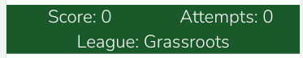
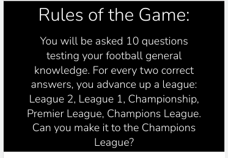
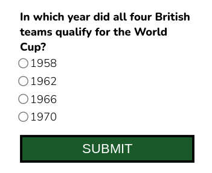
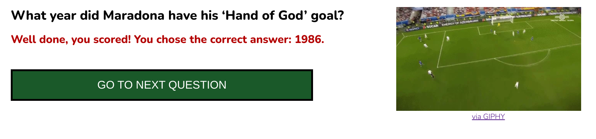
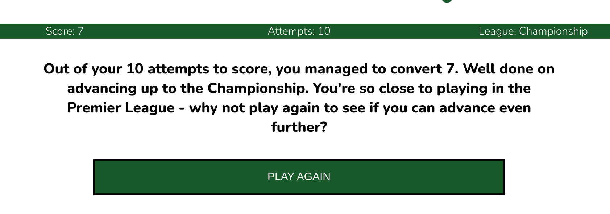

# Football Quiz

This is a quiz to test football fans' general knowledge of the sport; quiz players have a goal to earn their spot in the Champions League by getting all ten question attempts correct (i.e., scoring 10 out of 10). As 'football' could refer to two different sports, depending on geograpical location, I included two footballs (as opposed to American footballs) in the main header to make it clear from first glance on the website. Once the game is complete, players are encouraged to play again to either improve or maintain their title.

## Existing Features

### Favicon
 The favicon is the same image that is used in the logo to add consistency across the site. It also makes it very clear that this is a football-related website.

### Header
The header makes it clear what the website is. It is 80% width to line up with the content and be responsive across devices

### Score tally
A band across the top of the website shows the player how many answers they have had correct, how many attempts they've had (i.e., how many questions they have answered) and what their current league status is. This is optimised for mobile with the league dropping to the next line.
#### Desktop view

#### Mobile view

### Rules
The rules section at the top spells out clearly what the game's goal is. It disappears once the first answer is submitted to keep the page cleaner, but there is a button at the bottom of the page to make it reappear if a user wishes. It will subsequently disappear again once the user goes onto submit another answer or views the next question at which time the button reappears at the bottom of the page so a player can make the rules reappear at any point.

### Questions
A user gets randomly asked 10 questions generated from a javascript object nested in an array of 50 possibilities.

### Question Feedback
Once a user submits their response to the question, they get immediate feedback saying whether their answer was correct or incorrect whilst also providing the question and the correct answer for clarity to promote the likelihood that they will retain this information in future attempts. They will see a gif of a professional footballer either scoring a great goal and/or looking happy (if the answer is correct) or a gif of a professional missing an open goal and/or looking disappointed (if the answer is incorrect). They are then prompted to go to the next question.

### End of Game Feedback
Once the player has responded to ten questions, they are taken to a screen with an analysis of their performance and encouragement to play again. A 'play again' button resets the game so players can easily start again without manually refreshing the page.

## Future Features to Implement
<ul>
<li>Update questions/answers and add more gifs to keep the content current and interesting.</li>

<li>Create a login where users can see their previous performance.</li>

<li>Create another page entitled Champions League Leaders Board, which displays the names of players who answered all ten questions correctly (this would be populated by a prompt to players who score ten points who would be invited to submit their name onto a public leader board should they wish to do so). There would be a validation process to ensure that nothing inappropriate was submitted.</li></ul>

## Testing

### Validator Testing

<ul>
<li><strong>HTML:</strong> No errors were returned when passing through the official <a href="https://validator.w3.org/" aria-label="W3C validator website - opens in new window" target="new">W3C validator</a></li>
<li><strong>CSS: </strong> No errors were found when passing through the official <a href="https://jigsaw.w3.org/css-validator/" aria-label="W3C validator website - opens in new window" target="new">(Jigsaw) validator</a></li>
<li><strong>Javascript: </strong>No errors were found passing through the <a href="https://jshint.com/" aria-label="W3C validator website - opens in new window" target="new">jshint validator.</a></li>
</ul>

### Colour contrast
When initially selecting colours, I chose colours associated with football (green pitch, black/white ball, red card) and utilised <a href="https://webaim.org/resources/contrastchecker/" target="new" aria-label="WebAim Colour Checker website - opens in new window">WebAIM's colour contrast checker</a> to ensure the shades and combinations that I used on the site met AAA standards.

### Buttons
After testing, I realised that the button functions only ran properly if they were aligned with buttons already in the DOM (i.e., I couldn't just make them as temperal literals and have the functions run as required)

### Browsers
After deploying the site, I realised that the javascript file was only being read in Chrome, and it didn't work in Safari or Samsung Internet Browser. Upon testing, I discovered the issue was with the json file which held the Football Questions/Answers. Putting the array back in the script file fixed the problem so the website can be enjoyed across browsers.

### Favicon
I noticed that some websites were picking up the favicon for my last github project instead of the one specified even when the cache was cleared. I changed the filename to favicon2.ico, which fixed this.

## Deployment
The site was deployed to GitHub pages. The steps to deploy are as follows:
<ol><li>In the GitHub repository, navigate to the Settings tab</li>
<li>From the source section drop-down menu, select the Master Branch</li>
<li>Once the master branch has been selected, the page will be automatically refreshed with a detailed ribbon display to indicate the successful deployment.</li>
</ol>
The live link can be found here - <a href="https://mandyhole.github.io/football-quiz" target="new" aria-label="Football quiz website - opens in a new window">https://mandyhole.github.io/football-quiz</a>

## Credits

### Content
The facts for the quiz comes from:
<ul>
<li><a href="https://en.wikipedia.org/wiki/Main_Page" target="new" aria-label="Wikipedia website - opens in a new window">Wikipedia</a></li>
<li><a href="https://www.statista.com/topics/1595/soccer/#dossierContents__outerWrapper" target="new" aria-label="Statista website - opens in a new window">Statista Website</a></li>
<li><a href="https://www.stadiumguide.com/present/england/" target="new" aria-label="Stadium Guide website - opens in a new window">Stadium Guide Website</a></li> 
<li><a href="https://www.thefa.com/football-rules-governance/lawsandrules" target="new" aria-label="The FA website, rules section - opens in a new window">The FA Website</a></li>
<li>Hasbro World Football Trivial Pursuit Bite Size game</li></ul>

### Media

Clipart Image for Favicon/Logo: <a href="https://www.kindpng.com/imgv/TJJiT_png-clipart-soccer-ball-best-real-soccer-ball/" target="new" aria-label="Kind PNG website - opens in a new window">Kind PNG website</a>

Gifs: <a href="https://giphy.com/" target="new" aria-label="Giphy website - opens in a new window">Giphy website</a>

Nunito font used throughout the site: <a href="https://fonts.google.com/" target="new" aria-label="Google Fonts website - opens in a new window">Google Fonts</a>

Platform for inserting and creating a Favicon image: <a href="https://realfavicongenerator.net/" target="new" aria-label="Real Favicon Generator website - opens in a new window">Real Favicon Generator</a>

Platform for creating logo: Adobe Illustrator

### Code

Fix Manifest error appearing in console (from Favicon code - ultimately unused as icons weren't showing up):  <a href="https://stackoverflow.com/questions/59068699/manifest-line-1-column-1-syntax-error" target="new" aria-label="Stack Overflow website - opens in a new window">Stack Overflow</a>

Favicon Code - ultimately unused as icons weren't showing up as previous project icon was showing in deployed site: <a href="https://realfavicongenerator.net/" target="new" aria-label="Real Favicon Generator website - opens in a new window">Real Favicon Generator</a>

Importing json file (ultimately not used): <a href="https://bobbyhadz.com/blog/javascript-import-json-file" target="new" aria-label="Bobby Hadz website - opens in a new window">bobbyhadz.com</a> 

Formatting array in json file (ultimately not used): <a href="https://www.w3schools.com/whatis/whatis_json.asp" target="new" aria-label="w3Schools website - opens in a new window">w3Schools</a> 

Get value from selected radio button: <a href="https://stackoverflow.com/questions/15839169/how-to-get-value-of-selected-radio-button" target="new" aria-label="Stack Overflow website - opens in a new window">Stack Overflow</a>  

How to bring user to top of page: <a href="https://www.w3schools.com/howto/howto_js_scroll_to_top.asp" target="new" aria-label="w3Schools website - opens in a new window">w3Schools</a>
 and <a href="https://stackoverflow.com/questions/4147112/how-to-jump-to-top-of-browser-page" target="new" aria-label="Stack Overflow website - opens in a new window">Stack Overflow</a> 

Gif embed code: <a href="https://giphy.com/" target="new" aria-label="Giphy website - opens in a new window">giphy.com website</a>

Random number from Array: <a href="https://stackoverflow.com/questions/4550505/getting-a-random-value-from-a-javascript-array" target="new" aria-label="Stack Overflow website - opens in a new window">Stack Overflow</a>   

Increase size of radio buttons: <a href="https://stackoverflow.com/questions/4920281/how-to-change-the-size-of-the-radio-button-using-css" target="new" aria-label="Stack Overflow website - opens in a new window">Stack Overflow</a>

Check for vendor prefixes: <a href="https://autoprefixer.github.io/" target="new" aria-label="Autoprefixer CSS online  website - opens in a new window">Autoprefixer CSS online</a>