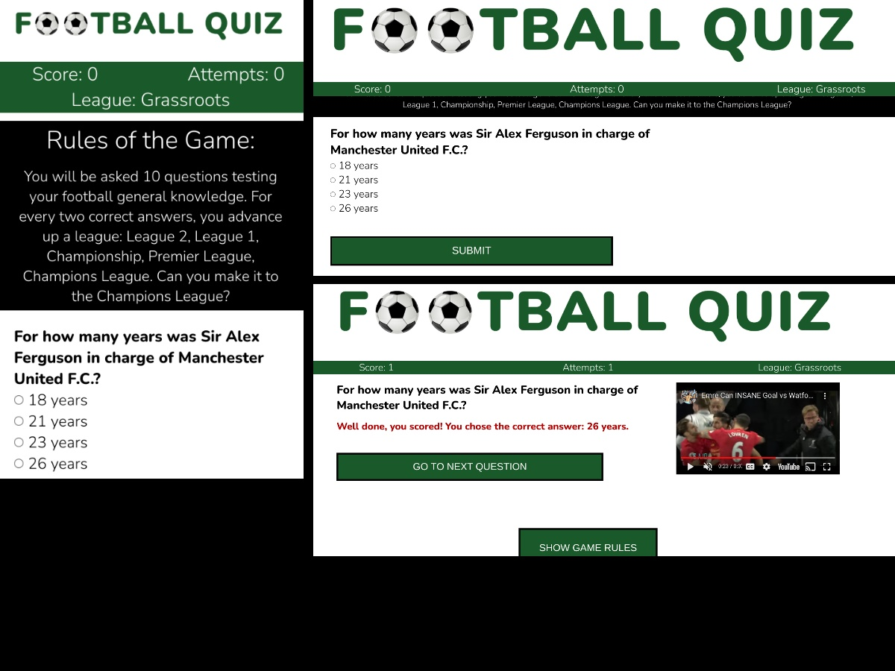

# Football Quiz

This is a quiz to test football fans' general knowledge of the sport; quiz players have a goal to earn their spot in the Champions League by getting all ten question attempts correct (i.e., scoring 10 out of 10). As 'football' could refer to two different sports, depending on geograpical location, I included two footballs (as opposed to American footballs) in the main header to make it clear from first glance on the website. Once the game is complete, players are encouraged to play again to either improve or maintain their title.

## Existing Features

### Favicon
The favicon is the same image that is used in the logo to add consistency across the site. It also makes it very clear that this is a football-related website.

### Header
The header makes it clear what the website is. It is 80% width to line up with the content and be responsive across devices

### Score tally
A band across the top of the website shows the player how many answers they have had correct, how many attempts they've had (i.e., how many questions they have answered) and what their current league status is. This is optimised for mobile with the league dropping to the next line.

### Rules
The rules section at the top spells out clearly what the game's goal is. It disappears once the first answer is submitted to keep the page cleaner, but there is a button at the bottom of the page to make it reappear if a user wishes. It will subsequently disappear again once the user goes onto submit another answer or views the next question at which time the button reappears at the bottom of the page so a player can make the rules reappear at any point.

### Questions
A user gets randomly asked 10 questions generated from a javascript object of 50 possibilities. 

### Question Feedback
Once a user submits their response to the question, they get immediate feedback saying whether their answer was correct or incorrect whilst also providing the question and the correct answer for clarity to promote the likelihood that they will retain this information in future attempts. They will see a gif of a professional footballer either scoring a great goal and/or looking happyp (if the answer is correct) or a gif of a professional missing an open goal and/or looking disappointed (if the answer is incorrect). They are then prompted to go to the next question.

### End of Game Feedback
Once the player has responded to ten questions, they are taken to a screen with an analysis of their performance and encouragement to play again. A 'play again' button resets the game so players can easily start again without manually refreshing the page.

## Future Features to Implement
<ul>
<li>Update questions/answers and add more gifs to keep the content current and interesting.</li>

<li>Create a login where users can see their previous performance.</li>

<li>Create another page entitled Champions League Leaders Board, which displays the names of players who answered all ten questions correctly (this would be populated by a prompt to players who score ten points who would be invited to submit their name onto a public leader board should they wish to do so). There would be a validation process to ensure that nothing inappropriate was submitted.</li></ul>

## Testing

### Validator Testing

<ul>
<li><strong>HTML:</strong> No errors were returned when passing through the official <a href="https://validator.w3.org/" aria-label="W3C validator website - opens in new window" target="new">W3C validator</a></li>
<li><strong>CSS: </strong> No errors were found when passing through the official <a href="https://jigsaw.w3.org/css-validator/" aria-label="W3C validator website - opens in new window" target="new">(Jigsaw) validator</a></li>
<li><strong>Javascript: </strong>No errors were found passing through the <a href="https://jshint.com/" aria-label="W3C validator website - opens in new window" target="new">jshint validator.</a></li>
</ul>

### Colour contrast
When initially selecting colours, I chose colours associated with football (green pitch, black/white ball, red card) and utilised <a href="https://webaim.org/resources/contrastchecker/" target="new" aria-label="WebAim Colour Checker website - opens in new window">WebAIM's colour contrast checker</a> to ensure the shades and combinations that I used on the site met AAA standards.

### Buttons

## Deployment
The site was deployed to GitHub pages. The steps to deploy are as follows:
<ol><li>In the GitHub repository, navigate to the Settings tab</li>
<li>From the source section drop-down menu, select the Master Branch</li>
<li>Once the master branch has been selected, the page will be automatically refreshed with a detailed ribbon display to indicate the successful deployment.</li>
</ol>
The live link can be found here - https://mandyhole.github.io/football-quiz

## Credits

### Content
The facts for the quiz comes from:
<ul>
<li><a href="https://en.wikipedia.org/wiki/Main_Page" target="new" aria-label="Wikipedia website - opens in a new window">Wikipedia</a></li>
<li><a href="https://www.statista.com/topics/1595/soccer/#dossierContents__outerWrapper" target="new" aria-label="Statista website - opens in a new window">Statista Website</a></li>
<li><a href="https://www.stadiumguide.com/present/england/" target="new" aria-label="Stadium Guide website - opens in a new window">Stadium Guide Website</a></li> 
<li><a href="https://www.thefa.com/football-rules-governance/lawsandrules" target="new" aria-label="The FA website, rules section - opens in a new window">The FA Website</a></li>
<li>Hasbro World Football Trivial Pursuit Bite Size game</li></ul>

### Media

Clipart Image for Favicon/Logo: <a href="https://www.kindpng.com/imgv/TJJiT_png-clipart-soccer-ball-best-real-soccer-ball/" target="new" aria-label="Kind PNG website - opens in a new window">Kind PNG website</a>

Gifs: <a href="https://giphy.com/" target="new" aria-label="Giphy website - opens in a new window">Giphy website</a>

Nunito font used throughout the site: Google Fonts https://fonts.google.com/

Platform for inserting and creating a Favicon image: https://realfavicongenerator.net/

Platform for creating logo: Adobe Illustrator

### Code

Fix Manifest error appearing in console (from Favicon code): https://stackoverflow.com/questions/59068699/manifest-line-1-column-1-syntax-error

Favicon: https://realfavicongenerator.net/

Importing json file: https://bobbyhadz.com/blog/javascript-import-json-file

Formatting array in json file: https://www.w3schools.com/whatis/whatis_json.asp

How to bring user to top of page:  // https://www.w3schools.com/howto/howto_js_scroll_to_top.asp and https://stackoverflow.com/questions/4147112/how-to-jump-to-top-of-browser-page

Gif embed code: giphy.com

Random number: //  https://stackoverflow.com/questions/4550505/getting-a-random-value-from-a-javascript-array

<!-- 
Testing
Layout:
I originally designed the homepage using the theories taught in the course (using floats, display: none, column widths/heights). With a rather complicated design of double column intro and an aside, it was very difficult to look good without an unmanageable number of breakpoints; to have my content and photos line up, I had to give each div an arbitrary size, which meant that, depending on media widths, I would have had massive gaps between my columns. Also, I was having to have extra filler images appear or be hidden depending on how my content was split so there wasn’t a massive gap in a column. I also would have to check the height for various breakpoints to make sure the columns were the same size. Finally, as my aside appeared in the wrong place in the mobile view (under the qualifications intro), I then had to hide/show the original/duplicate depending on the media width. It was all very messy and complicated, and I knew there had to be a better way...

Upon recommendation from my Mentor, I tried flex-box for my pros/cons page. Researching that also let me to grid css, which I implemented on my tips page. Both were remarkably easier to use, and my gaps between both pages were consistent and the pages looked much more professional. Upon reflection, I decided to redo my homepage with grid to ensure consistency in gaps/margins through the site. Unfortunately, doing it retrospectively caused a lot more effort and took a lot of experimentation to get it right, removing the extra divs, images and formatting that were no longer required.

Hamburger menu:
I discovered that this would not work properly if the user had already scrolled down the page. Working with my mentor, we discovered the heading needed to be fixed as opposed to sticky.

Media queries:
To make the site responsive, I went from three to two columns on both the home and Tips pages for a smaller screen/tablet, and then down again to a one column layout for mobile. For the pros/cons page, it went from a two column to a one column layout for mobile. I also had to add alternate mobile images for some background images to ensure that the dog’s face was shown.

Consistency:
As I reviewed the site, I realised that there was a bit of inconsistency in various elements across the site, which I sought to address by changing the inconsistent elements to be stylised by classes which I then implemented throughout the site, removing only elements that had to change (e.g., the background image on the hero) to be used in specific ids/classes. I used this approach for the headings, buttons, top hero area and form areas (and as I mentioned earlier, redoing the homepage to ensure consistency with row and column gaps/margins).

Google Fonts:
As I reviewed the deployed site on my mobile, I realised that it wasn't recognising the Google Chewy font family and instead used a cursive. I realised that the link to the Google fonts was at the bottom of the CSS file instead of the top so I moved it to the top, which fixed the issue. To be on the safe side, I also changed the alternative font family to serif instead of cursive in case a font rendering issues happened to occur.

Incorrectly sized image and missing description:
As I reviewed the site using Lighthouse, I realised one image was sized to 4000px (I meant to do 400px) which slowed down the website as it was 1.7MB. I resized the image to 300px. I also realised that it wasn't picking up the meta description for the Tips page due to a typo so I fixed that.

Colour contrast:
When initially selecting colours, I utilised WebAIM's colour contrast checker to ensure the background colours I used were suitable for dark colour text at a normal size. I then found the lightest black shade I could that still met AAA standards for normal text to use as my main font colour. I put the blue/yellow combination into a colour wheel to find a complementary third colour: a shade of magenta pink. As it did not meet colour contrast standards for text, I used it solely for decoration.

Validator Testing
HTML: No errors were returned when passing through the official W3C validator
CSS: No errors were found when passing through the official (Jigsaw) validator
Unfixed Bugs
Form: The form submissions are currently set up to go to a form dump area on the Code Institute website. Ideally, these would be sent to my email so that I could respond accordingly, have reCAPTCHA functionality to weed out spam and an auto response/message so that the user knows that the form was successfully submitted. They were not fixed as I do not have a database capable of collecting data at the moment.
